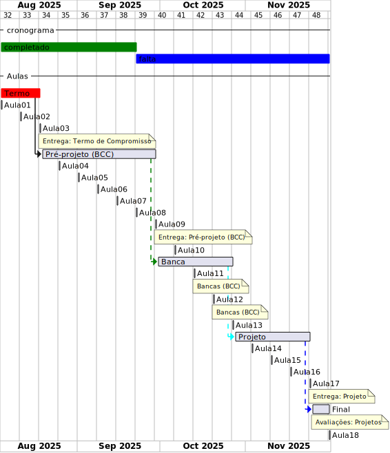

# Cronograma:  2025_2 BCC  
  
Local:  Remoto (MS-Teams)  
Dia da semana:  Segundas (18:30\~20:10)  
  
<!-- [ ] Aviso: Inicio das aulas <> -->  
  
## Eventos  
  
<!--[Semana Acadêmica](https://github.com/dalton-reis/dalton-reis/blob/main/_._/semanaAcademica.md "Semana Acadêmica") - horas AACCs  -->  
[SEMINCO](https://github.com/dalton-reis/dalton-reis/blob/main/_._/seminco.md "SEMINCO") - horas AACCs  
  
## Observações de Entrega  
  
- todas as entregas ([Termo de Compromisso](../Aulas/aula01Anotacoes.md#termo-de-compromisso "Termo de Compromisso"), [Pré-Projeto](../Aulas/aula02Anotacoes.md#modelos-projetos "Pré-Projeto") e [Projeto](../Aulas/aula02Anotacoes.md#modelos-projetos "Projeto")) devem ser encaminhadas por e-mail ao orientador que deverá repassar para o professor de TCC1 com um “De acordo”. Não encaminhe nada direto para o professor de TCC1 pois não será considerado válido;  
- certifique-se com o professor de TCC1 se o orientador fez o encaminhamento para o professor de TCC1;  
- encaminhamentos que não forem feitos (para o Pré-Projeto e Projeto) em até no máximo 3 dias após o prazo estabelecido implica na reprovação do estudante na disciplina;  
- todos os arquivos encaminhados devem ser em formato "docx".  
  
**ATENÇÃO**: sempre antes de encaminhar a entrega gere do arquivo "docx" um arquivo em "pdf" para verificar senão ocorreu nenhum erro.  
  
## Cronograma Resumido  
  
| Atividade | Prazo |  
|--- | ---- |  
| Entrega do Termo de Compromisso |  18-08-2025  |  
| Entrega do pré-projeto (curso de BCC) |  06-10-2025  |  
| Entrega do Projeto |  24-11-2025  |  
  
## Cronograma Gantt  
  

  
## Fluxograma  
  
  
  
## Cronograma Completo  
  
### Aula_01 04-08-2025  ( segunda-feira )  
  
<!-- \[AVISO] Termo atraso https://github.com/dalton-reis/disciplinaTCC1Privado/projects/1#card-67011391 -->  
- [aula01Anotacoes](../Aulas/aula01Anotacoes.md "aula01Anotacoes")  
- Termo - Formulação  
  
### Aula_02 11-08-2025  ( segunda-feira )  
  
- [aula02Anotacoes](../Aulas/aula02Anotacoes.md "aula02Anotacoes")  
- [aula02Slides](../Aulas/aula02Slides.pdf "aula02Slides")  
  
### Aula_03 18-08-2025  ( segunda-feira )  
  
> [!CAUTION]  
> **Entrega do Termo de Compromisso de TCC**  
  
- [aula03Anotacoes](../Aulas/aula03Anotacoes.md "aula03Anotacoes")  
- [aula03Slides](../Aulas/aula03Slides.pdf "aula03Slides")  
- Pré-Projeto - Formulação  
  
### Aula_04 25-08-2025  ( segunda-feira )  
  
<!-- \[AVISO] Orientadores https://github.com/dalton-reis/disciplinaTCC1Privado/projects/1#card-67524750 -->  
- [aula04Anotacoes](../Aulas/aula04Anotacoes.md "aula04Anotacoes")  
- [aula04Slides](../Aulas/aula04Slides.pdf "aula04Slides")  
- Pré-Projeto - Formulação  
  
<!-- \[AVISO] banca BCC https://github.com/dalton-reis/disciplinaTCC1Privado/projects/1#card-67445813 -->  
- [aula05Anotacoes](../Aulas/aula05Anotacoes.md "aula05Anotacoes")  
- Pré-Projeto - Formulação  
  
### Aula_05 01-09-2025  ( segunda-feira )  
  
- **não tem aula**  - Feriado: Aniversário do Município de Blumenau  
  
### Aula_06 08-09-2025  ( segunda-feira )  
  
<!-- \[AVISO] Atendimento BCC: https://github.com/dalton-reis/disciplinaTCC1Privado/projects/1#card-85660899 -->  
- Pré-Projeto - Atendimento Individual  

| Horário | Aluno |  
| -- | --- |  
| 19:00~19:10 | Eduardo Silverio Lyra |  
| 19:10~19:20 | Ivo Paulo Puehler Júnior |  
| 19:20~19:30 | Luís Felipe de Castilho |  
| 19:30~19:40 | Martin Lange de Assis |  
| 19:40~19:50 | Beatriz Conrat Muller da Silva |  
| 19:50~20:00 | Felipe Melio Tomelin |  
| 20:00~20:10 | Pedro Antonio de Faria Garcia |  
| 20:10~20:20 | Mateus Henrique Maas |  
| 20:20~20:30 | Rafael Barbosa Kretzer |  
  
### Aula_07 15-09-2025  ( segunda-feira )  
  
- Pré-Projeto - Atendimento Individual  

| Horário | Aluno |  
| -- | --- |  
| 19:00~19:10 | Lucas Jansen Gorges |  
| 19:10~19:20 | Felipe Babel |  
| 19:20~19:30 | Antônio José Brogni |  
| 19:30~19:40 | Luiz Henrique Martendal |  
| 19:40~19:50 | Rodrigo Heinzen de Moraes |  
| 19:50~20:00 | Vinícius Vanelli Silvestre Silva |  
| 20:00~20:10 | Gabriel de Souza Klauck |  
| 20:10~20:20 | Rubens Mette Junior |  
| 20:20~20:30 | Gabriel Eduardo Pereira |  
  
### Aula_08 22-09-2025  ( segunda-feira )  
  
- Pré-Projeto - Atendimento Individual  

| Horário | Aluno |  
| 19:00~19:10 | Pedro Gabriel Appel |  
| 19:10~19:20 | Thomas Anderson Rodrigues |  
| 19:20~19:30 | Daniel Kruger |  
| 19:30~19:40 | Ari Elias da Silva Júnior |  
| 19:40~19:50 | Eduardo Augusto Reinert |  
| 19:50~20:00 | Luigi Garcia Marchetti |  
| 20:00~20:10 | Gabriel Ramos dos Santos |  
| 20:10~20:20 | Alani Rigotti de Oliveira |  
| 20:20~20:30 | Caike Machado Batista Costa |  
  
### Aula_09 29-09-2025  ( segunda-feira )  
  
Evento: SEMINCO <https://github.com/dalton-reis/dalton-reis/blob/main/_._/seminco.md>  
  
### Aula_10 06-10-2025  ( segunda-feira )  
  
> [!CAUTION]  
> **Entrega do Pré-Projeto (BCC)**  
  
- [aula09AnotacoesBCC](../Aulas/aula09AnotacoesBCC.md "aula09AnotacoesBCC")  
  
### Aula_11 13-10-2025  ( segunda-feira )  
  
<!-- \[ ] Revisão dos Pré-Projetos: https://github.com/dalton-reis/disciplinaTCC1Privado/projects/1#card-86157761 -->  
- Revisão dos Pré-Projetos pelos professores de TCC1 e avaliadores.  
- **não tem aula**  - Feriado: Dia do Trabalhador  
  
### Aula_12 20-10-2025  ( segunda-feira )  
  
- Revisão dos Pré-Projetos pelos professores de TCC1 e avaliadores.  
- **não tem aula**  
  
### Aula_13 27-10-2025  ( segunda-feira )  
  
- Revisão dos Pré-Projetos pelos professores de TCC1 e avaliadores.  
- **não tem aula** - Feriado antecipado: Dia do Servidor Público  
  
### Aula_14 03-11-2025  ( segunda-feira )  
  
- [aula13Anotacoes](../Aulas/aula13Anotacoes.md "aula13Anotacoes")  
- Análise do Pré-Projeto - Atendimento Individual  
  
### Aula_15 10-11-2025  ( segunda-feira )  
  
- Análise do Pré-Projeto - Atendimento Individual  
  
### Aula_16 17-11-2025  ( segunda-feira )  
  
- Análise do Pré-Projeto - Atendimento Individual  
  
### Aula_17 24-11-2025  ( segunda-feira )  
  
> [!CAUTION]  
> **Entrega do Projeto**  
  
- Avaliação dos Projetos (banca)  
  
### Aula_18 01-12-2025  ( segunda-feira )  
  
- Avaliação dos Projetos (banca)  
  
<!-- [ ] Aviso: DION: fechar notas <> -->  
- Data final para devolução dos projetos pelos avaliadores:  08/12/23  
Último dia para entregar os diários de classe 2025/2: 29/11/25 - 10/12/25  
  